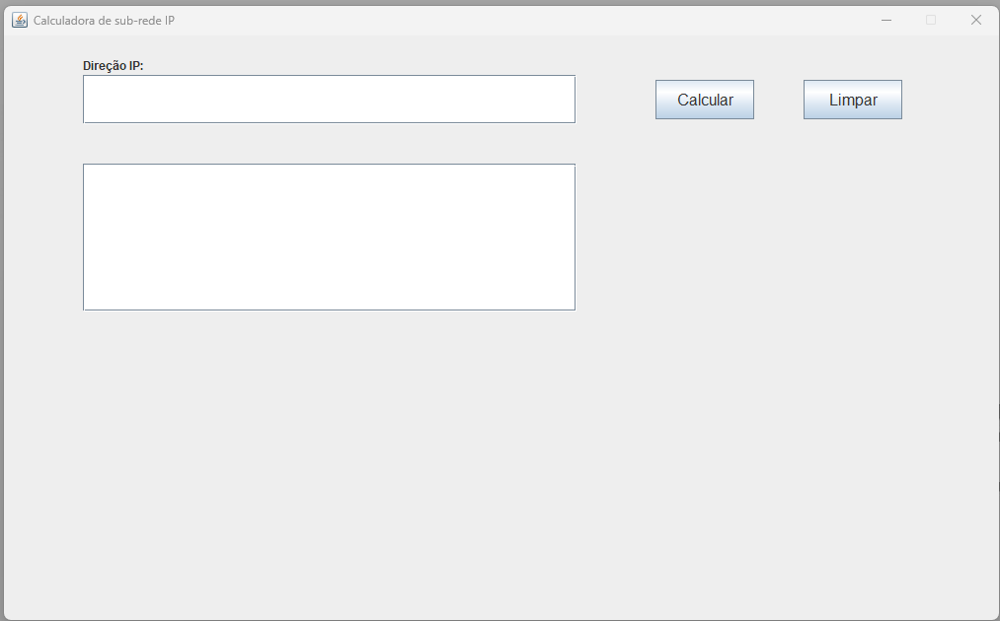

"# 01-IpClass" 

	Software desenvolvido nas aulas de Redes de Computadores,
	com objetivo de realizar calculos de sub-redes e informações de rede com base na direção do IP e máscara CIDR!! 

## Tecnologias
* Java
* Jframe
* IPV4

## Autor
[Kauan Lopes](https://www.linkedin.com/in/kauan-lopes-pereira-91b5a022a/)